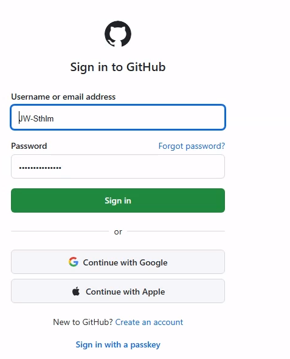
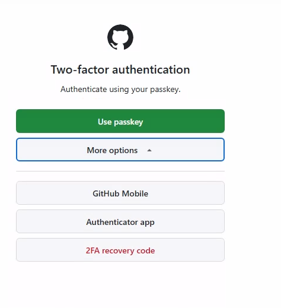
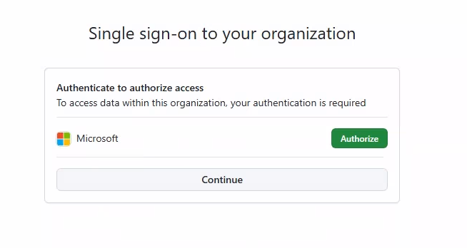

# Setup Guide — Copilot CLI Intro Session

> **Time needed:** 30–45 minutes the first time on a clean machine. About 10 minutes if you've installed similar tooling before.
> **What you'll end up with:** A working Copilot CLI with three MCP servers connected (PMX, GitHub, M365)

---

## Before You Start: Understand Your GitHub Accounts

As a Microsoft employee, you have access to GitHub Copilot at no cost to you — Microsoft provides the entitlement. But you need to make sure your account is connected to that entitlement.

You likely have **two** GitHub accounts:

| Account type | What it is | Username format |
|-------------|-----------|----------------|
| **EMU** (Enterprise Managed User) | Your Microsoft corporate account on GitHub | `yourname_microsoft` |
| **Personal** | Your own GitHub account | Whatever you chose |

**The key step:** Connect your **personal** GitHub account to the Microsoft Copilot entitlement. This gives your personal account full Copilot access — paid for by Microsoft, not you. Verify and connect at:

👉 **https://copilot.github.microsoft.com/**

This portal shows your entitlement status and walks you through connecting your personal account if it's not already linked.

**Which account should I use?**

- For **95% of Copilot CLI work**, use your **personal account**. That is the right default for this session.
- For installing the **PMX MCP server specifically**, temporarily use your **EMU account**. The PMX server lives in `gim-home/pmx-mcp`, which is in a Microsoft GitHub organization, so your personal account usually cannot clone it.
- The pattern is simple: **switch to EMU → install or clone PMX MCP → switch back to personal**.

If the guide tells you to switch accounts, copy this into PowerShell and replace `<account-name>`.

```
gh auth switch --user <account-name>
```

> **⚠️ Common trap** — If Copilot or `git` ever asks you for a Personal Access Token (PAT), stop.
> Don't generate one. Switch accounts instead with `gh auth switch --user <other-account>` and try again. PATs are not the right path for this workshop.

**Internal resources:**
- **Copilot portal:** https://copilot.github.microsoft.com/ — verify entitlement, connect accounts, check setup
- **Copilot guidelines:** https://eng.ms/docs/initiatives/ai-guidance-for-microsoft-developers/governance/github-copilot-guidelines
- **Quick Start guide:** Search "GitHub Copilot QuickStart" on the R&I SharePoint site — it has a verification function that checks your setup automatically
- **Agency / GitOps:** https://eng.ms/docs/coreai/devdiv/one-engineering-system-1es/1es-jacekcz/startrightgitops/agency

---

## How to use this guide

Each step has commands inside code blocks like this:

```
copilot --version
```

**Copying commands:** when you view this guide on GitHub or the published site, every code block has a small **Copy** button in its top-right corner — hover over the block to see it. That's the safest way to grab the exact command.

**The `>` at the end of a line in your terminal** is the *prompt* — it just means PowerShell is waiting for you to type. The full prompt usually looks like `PS C:\Users\YourName>`. None of that is part of any command — don't copy it.

**Pasting multiple lines into PowerShell:** when a code block has more than one line, PowerShell sometimes runs only the first line and beeps or warns about the rest. If that happens, paste the lines **one at a time** — wait for the prompt (`>`) to come back before pasting the next one.

**You'll be in two different "modes" during setup:**

- **PowerShell** — the regular Windows terminal, prompt looks like `PS C:\Users\YourName>`.
- **Copilot CLI** — runs *inside* the same window after you type `copilot`, prompt looks different (banner + a `❯` or `>` arrow). Type `/exit` to leave Copilot CLI and go back to PowerShell.

The guide will say "in PowerShell" or "in Copilot CLI" before each command so you know which mode you should be in.

**Installer pop-ups are normal:** during Step 1, when you run `winget install ...` commands, Windows will show pop-up windows — a security prompt asking *"Do you want to allow this app to make changes?"*, and sometimes an installer wizard for the tool itself (Git is the most common). **Click Yes / Accept / Next to allow the install.** This is expected — winget is downloading and running the official installer for each tool. Just accept the defaults and let it finish before running the next command.

---

## Step 1: Install command-line tools

CLI stands for **Command Line Interface** — meaning your interaction with Copilot happens entirely in a window where you type instructions and read responses, instead of clicking buttons in a UI. The "command line" is that typing-and-reading window itself.

To make Copilot CLI work, you need 5 small tools on your machine: Node.js, Git, GitHub CLI, Azure CLI, and Copilot CLI itself. None of them have buttons or windows of their own — they sit underneath, ready to be called from your command line.

There are two ways to install them. Both end at the same place. Auth (Steps 2–5) is manual either way.

| Path | Time | Best for |
|------|------|----------|
| **Express** — one script installs all 5 | 2–3 min | You want to skip the boring clicking |
| **Manual** — 5 separate winget commands | 10–15 min | You want to learn what's on your machine, or your IT blocks scripts |

### 1a. Open PowerShell 7

Both paths use **PowerShell 7** (also called `pwsh`), not the older "Windows PowerShell" that ships with Windows by default. PowerShell 7 is the modern version and what every command in this guide expects.

1. Press the Windows key, type `PowerShell`
2. Click the result that says **PowerShell 7** or **pwsh**
3. If you only see "Windows PowerShell" in the results, run this once in that window, then close it and look again:

   ```
   winget install Microsoft.PowerShell
   ```

You should now have a window with a prompt that ends in `>`. Leave it open — you'll use it for the rest of setup.

### 1b. Get the workshop files

The Express script and the `verify.ps1` check live in this repo. You need a local copy.

Run these **one at a time** (paste, press Enter, wait, then paste the next):

```
winget install Git.Git
```

```
git clone https://github.com/JW-Sthlm/cli-intro.git $HOME\cli-intro
```

```
cd $HOME\cli-intro
```

What each line does:

- **`winget install Git.Git`** installs Git itself. (If you already have it, winget will say so and skip — safe to run anyway.)
- **`git clone …`** copies the workshop folder from GitHub onto your machine. It lands at `C:\Users\YourName\cli-intro` (because `$HOME` is PowerShell shorthand for your user folder, `C:\Users\YourName`).
- **`cd $HOME\cli-intro`** moves you *into* that folder. `cd` stands for "change directory". After this, every command you run will look in that folder first.

You can tell it worked because your prompt will change. Before the `cd`, it looks something like:

```
PS C:\Users\YourName>
```

After the `cd`, it should look like:

```
PS C:\Users\YourName\cli-intro>
```

The path inside `PS …>` always tells you which folder you're "inside" right now.

### 1c. Install the rest of the tools

Pick **Option A** or **Option B**.

#### Option A: Express path (recommended)

Open `v2\pre-work\express-setup.ps1` in any text editor first if you want to see what it does — it's about 10 lines, all winget commands, no surprises.

From inside the `cli-intro` folder (your prompt should still read `PS C:\Users\YourName\cli-intro>`), run:

```
.\v2\pre-work\express-setup.ps1
```

The leading `.\` means "in this current folder" — it tells PowerShell to look for the script right where you are, not somewhere else on the system.

When the script finishes, **close that PowerShell window**, **open a new PowerShell 7 window** the same way you did in step 1a, then `cd` back into the workshop folder:

```
cd $HOME\cli-intro
```

Then verify Copilot CLI is reachable:

```
copilot --version
```

You should see a version number. If you get an error, close PowerShell, open a new window, and try again.

(The fresh window is needed because some installs only become available to *new* PowerShell sessions, not the one that did the installing.)

✅ **Done with Option A.** Continue to **Step 2: Log In** below.

> **⚠️ Common trap** — If your corporate IT or Defender policy blocks the script, use Option B instead.

#### Option B: Manual path

Run these one at a time. Wait for each to finish before starting the next.

```
winget install OpenJS.NodeJS.LTS
```

```
winget install GitHub.cli
```

```
winget install Microsoft.AzureCLI
```

```
winget install GitHub.Copilot
```

(Git was already installed in step 1b, so it's not in this list.)

When all four are done, **close that PowerShell window and open a new PowerShell 7 window**, then go back into the workshop folder:

```
cd $HOME\cli-intro
```

Then verify Copilot CLI is reachable:

```
copilot --version
```

You should see a version number. If you get an error, close PowerShell, open a new window, and try again.

✅ **Done with Option B.** Continue to **Step 2: Log In** below.

---

## Step 2: Log In

You'll log into two different things: **Copilot CLI** itself (so it can talk to the AI model), and **GitHub CLI** (so other tools and scripts in the workshop can talk to GitHub on your behalf).

### 2a. Sign in to Copilot CLI

**In PowerShell** — start Copilot CLI by typing `copilot` and pressing Enter:

```
copilot
```

The first time you launch Copilot CLI in this folder, it shows a **"Confirm folder trust"** prompt asking whether to allow it to read and execute code in `C:\Users\YourName\cli-intro`. Use the arrow keys to select option **2. Yes, and remember this folder for future sessions**, then press Enter. (Picking option 2 means you won't be asked again next time you launch Copilot CLI here.)

When the Copilot banner appears, the prompt changes — you're now **inside Copilot CLI**.

**Inside Copilot CLI** — type `/login` and press Enter:

```
/login
```

You'll see a prompt asking *"What account do you want to log into?"* with two options. Pick option **1. GitHub.com** and press Enter. (Option 2 is for enterprise customers with a custom GitHub data-residency setup — not what you want here.)

Follow the on-screen instructions — it will open a browser window where you authenticate with your **personal** GitHub account (recommended for this session).

You'll go through three browser screens. Here's what to do at each:

**1. Sign in to GitHub** — enter your personal GitHub username and password.



**2. Two-factor authentication** — confirm using whatever method you have set up (passkey, GitHub Mobile, or authenticator app).



**3. Single sign-on to your organization** — if your personal GitHub account is also a member of an organization that requires SSO (most Microsoft employees will see **Microsoft** here), click the green **Authorize** button next to the organization, then click **Continue**.



> **Why authorize?** Authorizing extends your GitHub session so Copilot CLI can read repos and resources inside that org. It's safe and expected — without it, you'll hit "resource not accessible by integration" errors later when working with org-internal repos. If you don't recognize the org name, click **Continue** without authorizing.

> **Note:** You need an active Copilot subscription on the account you log in with. Verify at https://copilot.github.microsoft.com/ or https://github.com/settings/copilot.

When login finishes, you're still **inside Copilot CLI**. To run the next step you need to be back in PowerShell — same window, just step out of Copilot:

**Inside Copilot CLI** — type `/exit` and press Enter:

```
/exit
```

The Copilot banner disappears and you're back at the PowerShell prompt (`PS C:\Users\YourName\cli-intro>`). Same window — you do **not** open a new one.

### 2b. Sign in to GitHub CLI (`gh`)

The `/login` step above signed you into **Copilot CLI**. There's a separate tool — **GitHub CLI** (`gh`) — that some later steps use to talk to GitHub on your behalf (the verify script in Step 3, and the PMX MCP install in Step 5). It has its own login. You'll sign in twice — once for each account from "Before You Start".

**First, your personal account.**

**In PowerShell** — run:

```
gh auth login
```

It will ask you several questions one at a time. Use the arrow keys to pick the answer, then press Enter:

- *What account do you want to log into?* → **GitHub.com**
- *What is your preferred protocol for Git operations?* → **HTTPS**
- *Authenticate Git with your GitHub credentials?* → **Yes**
- *How would you like to authenticate GitHub CLI?* → **Login with a web browser**

It shows a one-time code and opens a browser tab. Paste the code in the browser, sign in with your **personal** GitHub account, and authorize. When the browser says "Congratulations, you're all set!", come back to PowerShell — it should now print `✓ Logged in as <your-personal-username>`.

**Then, your Microsoft EMU account.**

Run the same command again:

```
gh auth login
```

Same answers as before, but this time sign in with your `yourname_microsoft` (EMU) account in the browser.

> **Don't have a `_microsoft` EMU account?** Skip this second login. You'll be able to do most of the workshop — only the PMX MCP server in Step 5 needs it, and we can demo that together.

> **Stuck on "We couldn't sign you in" with a passkey error?** This is common when your phone is the registered passkey holder. Click **Sign in another way** in the dialog and pick **Microsoft Authenticator** (push to phone) or text/call.

**Set your personal account as the active one.** After two logins, the EMU account is the active default. Switch back to personal so the rest of the workshop uses it by default:

```
gh auth status
```

Look at the output for the line that starts with `Logged in to github.com account <name>` for your **personal** account — copy that name. Then:

```
gh auth switch --user <your-personal-username>
```

(Replace `<your-personal-username>` with the name you just copied.)

Run `gh auth status` again to confirm — your personal account should now show `Active account: true`.

---

## Step 3: Verify It Works

**In PowerShell** — from the `cli-intro` folder, run the automatic pre-check:

```
.\v2\pre-work\verify.ps1
```

(If your prompt isn't `PS C:\Users\YourName\cli-intro>`, run `cd $HOME\cli-intro` first.)

The script will tell you what's installed, what's logged in, and what's still missing.

Then launch Copilot CLI again and ask one simple question to confirm the model is answering:

```
copilot
```

**Inside Copilot CLI** — type a question and press Enter:

```
What day is it today?
```

If you get an answer, you're in business. Type `/exit` and press Enter to return to PowerShell.

---

## Step 4: Log In to Azure (for PMX)

The PMX MCP server needs an Azure login to talk to Dynamics 365. Azure CLI was already installed in Step 1, so this is just the sign-in.

**In PowerShell** — run:

```
az login --tenant 72f988bf-86f1-41af-91ab-2d7cd011db47
```

A browser window will open. Sign in with your Microsoft account. Once it says "You have logged in", you're done.

> **⚠️ Common trap** — If `az login` shows a list of subscriptions and asks you to choose one, just press Enter.
> It doesn't matter which one for this workshop — we only need a valid Azure session, not a specific subscription.

---

## Step 5: Connect Your Tools (MCP Servers)

MCP servers are connectors that let Copilot CLI talk to external tools — think of them like Power Automate connectors. We need three:

1. **GitHub** — repos, issues, pull requests
2. **M365** — email, calendar, Teams
3. **PMX** — your partner management data in D365 (Microsoft-internal, installed last)

We do this in two passes because **PMX requires your Microsoft EMU account** to be the active GitHub account, while GitHub and M365 work fine with your personal one. Install the public ones first, then switch accounts and install PMX.

### 5a. Install GitHub and M365 (personal account)

Make sure your personal account is the active GitHub account:

**In PowerShell** — run:

```
gh auth status
```

Your personal account should show `Active account: true`. If not, run `gh auth switch --user <your-personal-username>` first.

Then launch Copilot CLI:

```
copilot
```

You'll see the Copilot CLI banner appear. The prompt will change — instead of `PS C:\Users\YourName\cli-intro>` you'll see something like a `❯` or `>` arrow on its own line. That means you're now **inside Copilot CLI**, not PowerShell.

**Inside Copilot CLI** — type this prompt and press Enter:

```
Set up the official GitHub and M365 MCP servers in my Copilot CLI config. Walk me through it step by step.
```

Copilot will walk you through it. Answer in plain language — no syntax memorization needed.

> **⚠️ Common trap** — Copilot will ask **"Where do you want to configure these MCP servers?"** and show a numbered menu. Pick **2. Copilot CLI**. The other options configure MCP for VS Code's Copilot Chat, GitHub Copilot Coding Agent, or other tools — not your local CLI session.

When done, **type `/exit` and press Enter** to leave Copilot CLI and return to PowerShell.

### 5b. Install PMX (Microsoft EMU account)

PMX is the special case. Its server lives in `gim-home/pmx-mcp`, which only your Microsoft EMU (`yourname_microsoft`) account can access. So: switch accounts, install PMX, switch back.

> **⚠️ Critical — switch the account FIRST.** If you launch Copilot CLI with your personal account active and ask it to install PMX, it cannot see the private `gim-home/pmx-mcp` repo and will helpfully install the **wrong** thing — there's a public `Galvill/pmx-mcp` (Proxmox virtualization tools, completely unrelated). Don't trust the AI to know which "PMX" you mean. Switch accounts first.

You'll be jumping **between PowerShell and Copilot CLI in the same window**.Watch the prompt to know which mode you're in:

- `PS C:\Users\YourName\cli-intro>` → you're in PowerShell.
- A banner with a `❯` or `>` arrow → you're inside Copilot CLI.

If you're inside Copilot CLI when a step says "in PowerShell", type `/exit` and press Enter first.

1. **In PowerShell** — switch to your EMU account and tell git to use it:

   ```
   gh auth switch --user <yourname>_microsoft
   gh auth setup-git
   gh auth status
   ```

   The third command should show your `_microsoft` account as `Active account: true`. The middle one (`gh auth setup-git`) tells `git` to use the EMU credentials directly, instead of asking Windows to pop up a separate "Connect to GitHub" dialog when Copilot tries to clone.

2. **In PowerShell** — confirm the private repo is reachable:

   ```
   gh repo view gim-home/pmx-mcp
   ```

   You should see the repo's description and details. If you get a 404 instead, the account switch didn't take — re-run step 1.

3. **In PowerShell** — launch Copilot CLI:

   ```
   copilot
   ```

4. **Inside Copilot CLI** — ask it to install the PMX MCP server:

   ```
   Install the PMX MCP server from github.com/gim-home/pmx-mcp. Clone, build, and register it in my Copilot CLI MCP config.
   ```

5. **Inside Copilot CLI** — when PMX is installed, leave Copilot CLI:

   ```
   /exit
   ```

6. **Back in PowerShell** — switch back to your personal account:

   ```
   gh auth switch --user <your-personal-username>
   ```

7. **In PowerShell** — verify your personal account is active again:

   ```
   gh auth status
   ```

You can also use the built-in command `/mcp` (inside Copilot CLI) to browse and add servers from a menu.

> **Having trouble?** MCP setup depends on your environment and permissions. If it doesn't work, don't worry — we'll troubleshoot together at the start of the session. Just make sure Steps 1–4 are done.

---

## Step 6: Verify MCP Servers

**In PowerShell** — launch Copilot CLI:

```
copilot
```

**Inside Copilot CLI** — type `/env` and press Enter to see the runtime environment and connected MCP servers:

```
/env
```

Look for the MCP servers section. You should see entries for PMX, GitHub, and M365 tools. If any are missing, double-check your config file path and contents.

**Inside Copilot CLI** — try a quick PMX smoke test:

```
Show me my PMX projects
```

If you see project data from D365, everything is connected. Type `/exit` and press Enter to return to PowerShell.

---

## Troubleshooting

If you'd rather run a one-shot check, use `verify.ps1` (added in `pre-work/`) — it'll tell you exactly what's missing and how to fix it.

| Problem | Fix |
|---------|-----|
| `winget` not found | Install it from the Microsoft Store (search "App Installer") |
| `copilot` command not found after install | Close and reopen PowerShell. If still missing, check your PATH |
| `/login` fails or times out | Make sure you're on the corporate network or VPN |
| Asked for a Personal Access Token | Stop. Don't create one. Switch accounts with `gh auth switch --user <other-account>` and try again |
| `az login` fails | Run `winget install Microsoft.AzureCLI` first, restart PowerShell |
| Stuck on the Azure subscription picker | Press Enter. The subscription choice does not matter for this workshop |
| PMX returns errors | Re-run `az login --tenant 72f988bf-86f1-41af-91ab-2d7cd011db47` |
| MCP prompt unclear which to pick | See Step 5 placeholder. Default to the user/global option, do not choose Copilot Cloud Agent, and verify with Taras |
| MCP servers not showing in `/env` | Check that `mcp-config.json` is in the right folder and is valid JSON |

---

## What to Bring to the Session

- A laptop with everything above working
- PowerShell open and ready
- Curiosity — no coding skills needed

## After the Session

For self-paced deep dives, check out the official beginner course:
- **Course:** https://jamesmontemagno.github.io/copilot-cli-for-beginners/ (~2 hours)
- **Repo:** https://github.com/github/copilot-cli-for-beginners (Codespaces-ready)
